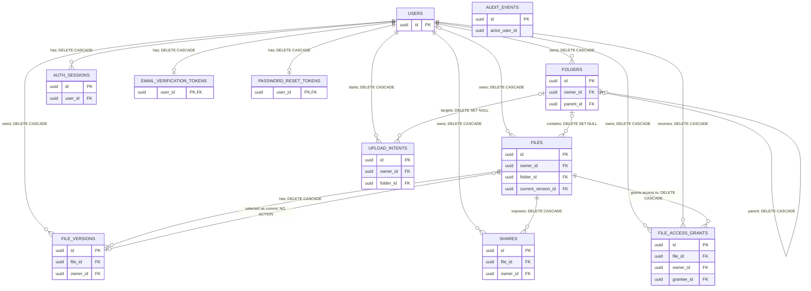
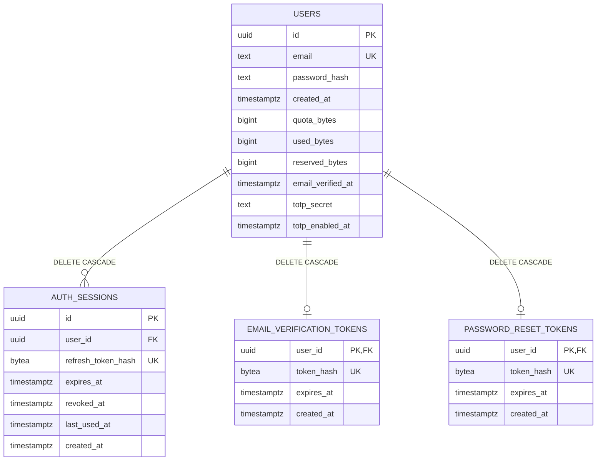
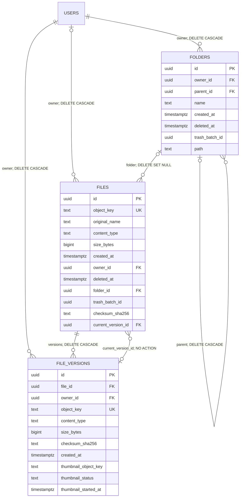
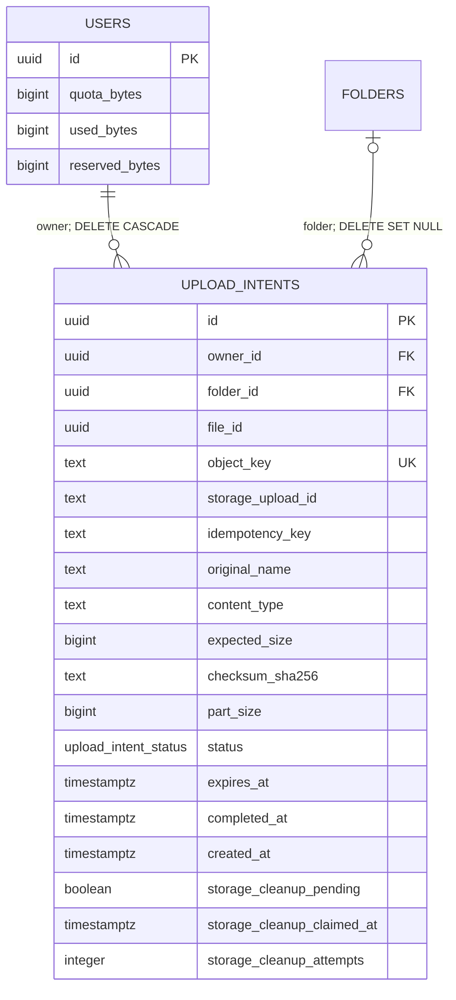
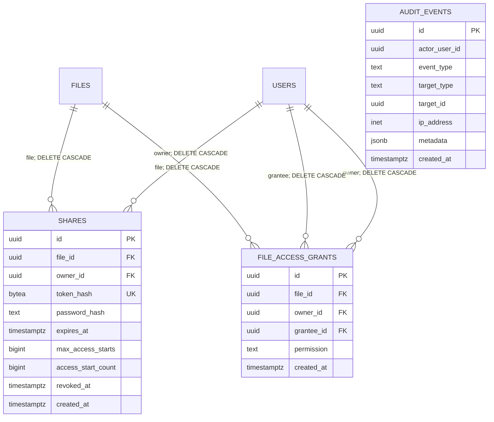

# Cloudlet database ER diagram

This document describes the **final application schema** produced by
`internal/database/migrations/001_create_files.sql` through
`026_add_upload_cleanup_state.sql`. It was cross-checked against the running
PostgreSQL catalog using read-only queries over `information_schema`,
`pg_constraint`, and `pg_indexes`.

Cloudlet stores relational metadata in PostgreSQL. File and thumbnail binary
content is not stored in PostgreSQL. An `object_key` identifies an object in the
private S3-compatible bucket, such as MinIO or Cloudflare R2.

## Complete relationship map

The map contains all 11 persistent application tables and all 17 database-enforced
foreign keys. `actor_user_id`, `upload_intents.file_id`, and the trash batch UUIDs
are deliberately not drawn as relationships because the final schema does not
attach foreign keys to them.

Cardinality follows the final catalog, including the legacy-nullable
`files.owner_id`. Application-created files have an owner, but PostgreSQL still
permits `NULL` in that column. `files.current_version_id` is optional and has no
`ON DELETE` clause, so PostgreSQL uses `NO ACTION`. A version can technically be
selected by more than one file because that foreign-key column is not unique.

## Identity and authentication

Application writes account passwords and optional share passwords as bcrypt hashes; plaintext passwords are never intentionally persisted. PostgreSQL stores these values in `TEXT` columns and cannot itself enforce the bcrypt encoding, so this statement describes the application write path rather than a catalog constraint.
Refresh, share, email-verification, and password-reset tokens are never stored in
plaintext. Their secure hashes are persisted instead. New TOTP setup and enable operations store `users.totp_secret` with AES-256-GCM; the encryption key remains outside PostgreSQL and the user UUID is bound as authenticated data. The reader retains backward compatibility for unprefixed secrets written before encryption was introduced, so the database type alone does not guarantee that every legacy row has already been migrated.

## Files, folders, versions, and thumbnails

`folders.parent_id` is the self-referencing hierarchy edge. The materialized
`folders.path` accelerates subtree operations. `trash_batch_id` groups files and
folders moved to trash together, but there is no `trash_batches` table and no
foreign key for these UUIDs. Soft-deleted rows remain billable until permanent
retention cleanup.

Each `file_versions.object_key` points to an immutable private object. Thumbnail
metadata is stored on the version itself. There is no separate thumbnail table:
`thumbnail_object_key`, `thumbnail_status`, and `thumbnail_started_at` describe
the derived private thumbnail object and its worker state.

## Uploads, quota, and jobs

`upload_intents.file_id` reserves the future file UUID but is **not** a foreign
key. Status values are `PENDING`, `COMPLETED`, `EXPIRED`, `CANCELLED`, and
`FAILED`. Cleanup columns make abort cleanup retryable for expired multipart uploads.
Quota is maintained on `users`: reserved bytes cover in-flight uploads, while
used bytes include every persisted version and trashed content until permanent
deletion.

Background jobs use River in the same PostgreSQL database. The live database
contains `river_job`, `river_leader`, `river_migration`, `river_notification`,
and `river_queue`. These are third-party infrastructure tables managed by River,
not Cloudlet product entities, so they are intentionally excluded from the main
ER diagrams and data dictionary.

## Sharing and audit

Audit events are append-only: a database trigger rejects `UPDATE` and `DELETE`.
Migration 025 intentionally removed the `audit_events.actor_user_id` foreign key.
This allows account deletion while preserving the deleted user's UUID as a
historical identity. Consequently, `actor_user_id` is not an active relationship
in the final schema.

## Data dictionary

| Table | Responsibility | Ownership boundary | Important foreign keys | Deletion / retention | Sensitive data |
|---|---|---|---|---|---|
| `users` | Identity, credential state, email verification state, TOTP state, and quota counters. | Root aggregate for one account. | None. | Deleting a user cascades through owned application metadata. Audit actor UUIDs remain historical values. | **Yes.** Email, application-generated bcrypt password hash, TOTP secret storage, quota/account state. New TOTP writes are AES-256-GCM encrypted; legacy unprefixed values remain readable for compatibility. |
| `auth_sessions` | Refresh-session lifecycle and rotation state. | One user owns many sessions. | `user_id → users.id` (`CASCADE`). | Expiration and revocation make sessions invalid but retain the row; there is no automatic database cleanup job. Account deletion removes rows through the user FK cascade. | **Yes.** SHA-256 refresh-token hash and session timestamps. |
| `email_verification_tokens` | Current single-use email-verification challenge. | At most one row per user because `user_id` is both PK and FK. | `user_id → users.id` (`CASCADE`). | Replacement overwrites the row, successful consumption deletes it, and account deletion cascades. Expiry prevents use but does not itself delete the row. | **Yes.** Token hash only, never plaintext. |
| `password_reset_tokens` | Current single-use password-reset challenge. | At most one row per user because `user_id` is both PK and FK. | `user_id → users.id` (`CASCADE`). | Replacement overwrites the row, successful reset deletes it, and account deletion cascades. Expiry prevents use but does not itself delete the row. | **Yes.** Token hash only, never plaintext. |
| `folders` | Owned hierarchy, materialized paths, soft deletion, and trash grouping. | Every folder belongs to one user; parent folders form an owned tree. | `owner_id → users.id` (`CASCADE`), `parent_id → folders.id` (`CASCADE`). | Parent deletion cascades to descendants. Soft-deleted trees retain metadata and quota-relevant contents until permanent cleanup. | Usually no; names and hierarchy may reveal user metadata. |
| `files` | Logical file identity, display metadata, placement, soft deletion, and selected current version. | Normally one owner; catalog retains legacy optionality on `owner_id`. | `owner_id → users.id` (`CASCADE`), `folder_id → folders.id` (`SET NULL`), `current_version_id → file_versions.id` (`NO ACTION`). | Soft deletion uses `deleted_at`; permanent file deletion cascades to versions, shares, and grants. | Metadata may be sensitive. Binary content is not stored here. |
| `file_versions` | Immutable object versions, checksums, byte accounting, and thumbnail worker state. | One file and one owner per version. | `file_id → files.id` (`CASCADE`), `owner_id → users.id` (`CASCADE`). | File/account deletion removes rows after object cleanup. Retention prunes eligible non-current versions; trash versions remain until trash is permanently deleted. | Object keys and checksums are sensitive metadata; no binary content. |
| `upload_intents` | Multipart reservation, idempotency, completion state, and retryable storage cleanup. | One owner; optional destination folder. | `owner_id → users.id` (`CASCADE`), `folder_id → folders.id` (`SET NULL`). `file_id` is not an FK. | Pending intents expire. Expired multipart storage cleanup is claimed and retried using cleanup state; `FAILED` status alone does not enter that retry path. | **Yes.** Private object key, storage upload ID, checksum, and idempotency key. |
| `shares` | Public link access policy, revocation, expiry, and access-start limits. | One owner exposes one file per share row. | `file_id → files.id` (`CASCADE`), `owner_id → users.id` (`CASCADE`). | File/account deletion cascades; links may also expire or be revoked. | **Yes.** Share-token hash and optional bcrypt password hash, never plaintext secrets. |
| `file_access_grants` | Direct user-to-user read/write permission for a file. | Owner grants access to a distinct registered grantee. | `file_id`, `owner_id`, and `grantee_id` cascade from their referenced file/users. | File deletion or deletion of either participating account removes the grant. | Contains authorization relationships, but no token or password. |
| `audit_events` | Security and activity history. | System-level append-only history; actor may no longer exist. | None in the final schema. `actor_user_id` is a historical UUID. | Database trigger rejects updates/deletes. User deletion does not erase or mutate the actor UUID. | **Yes.** May contain user UUID, IP address, target identifiers, and structured metadata. |

## Important constraints and indexes

Mermaid ER syntax does not express every PostgreSQL check, partial index, view,
or trigger. The operationally important details are:

- Active sibling names are case-insensitively unique:
  - `files_unique_active_name_idx` covers owner, nullable folder, and lowercased
    file name where `deleted_at IS NULL`.
  - `folders_unique_active_name_idx` covers owner, nullable parent, and lowercased
    folder name where `deleted_at IS NULL`.
- `files.object_key`, `file_versions.object_key`, and
  `upload_intents.object_key` are unique private-object references.
- SHA-256 checksum fields are constrained to 64 lowercase hexadecimal
  characters. File and version byte sizes cannot be negative; upload expected
  size must be positive; multipart part size is at least 5 MiB.
- `users_storage_nonnegative` prevents negative quota, used, or reserved byte
  counters. Old versions and trash continue to count toward quota until their
  objects and rows are permanently removed.
- `upload_intents_active_idempotency_idx` makes `(owner_id, idempotency_key)`
  unique only for `PENDING` or `COMPLETED` intents, allowing retry after terminal
  failed/cancelled/expired states. Partial indexes also select pending expiry and
  storage cleanup work.
- `file_access_grants` allows only `read` or `write`, forbids self-grants, and is
  unique per `(file_id, grantee_id)`.
- `shares.token_hash`, `auth_sessions.refresh_token_hash`, and both verification
  token hashes are unique. Share counts are non-negative and optional limits
  must be positive.
- Thumbnail state is constrained to `PENDING`, `PROCESSING`, `READY`, `FAILED`,
  or `UNSUPPORTED`; a partial index selects pending thumbnail jobs.
- `active_files` and `active_folders` are views filtering
  `deleted_at IS NULL`. They are not persistent tables and are therefore not ER
  entities.
- Trigram GIN indexes accelerate active file/folder name search, and
  `folders_path_prefix_idx` accelerates materialized-path subtree queries.
- `audit_events_append_only` rejects every update or delete. The table has no
  final actor foreign key by design.

## PostgreSQL catalog verification

The running Docker PostgreSQL instance was queried in read-only transactions.
The final catalog contains:

- **11 application base tables** documented above.
- **17 application foreign keys**, all represented in the complete relationship
  map.
- **2 application views**: `active_files` and `active_folders`.
- **5 River infrastructure tables**, documented separately rather than modeled
  as product entities.
- The expected primary keys, unique constraints/indexes, checks, partial indexes,
  and delete actions from migrations 001 through 026.

No migration/catalog inconsistency was found. In particular, catalog inspection
confirmed the intentionally absent audit actor FK, the non-FK upload/trash UUIDs,
the `files.current_version_id` `NO ACTION` behavior, and the renamed share
counter columns `max_access_starts` and `access_start_count`.
